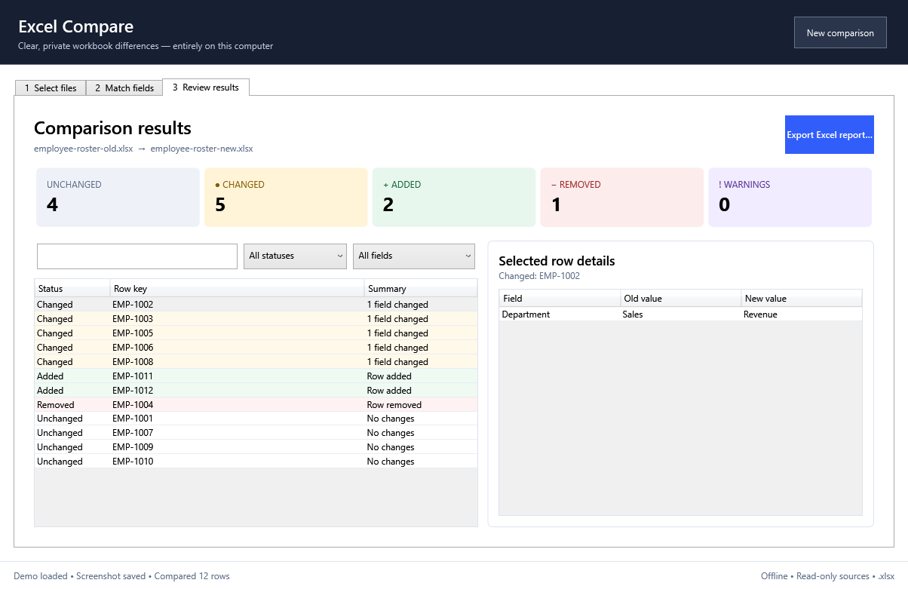
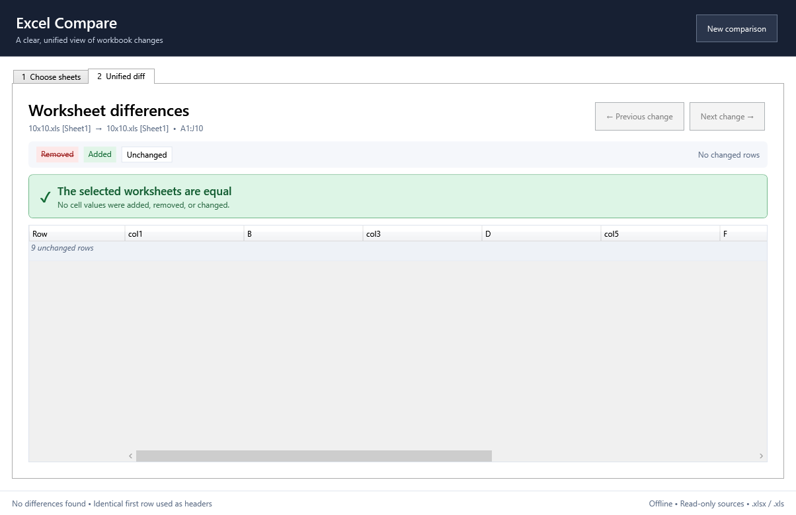
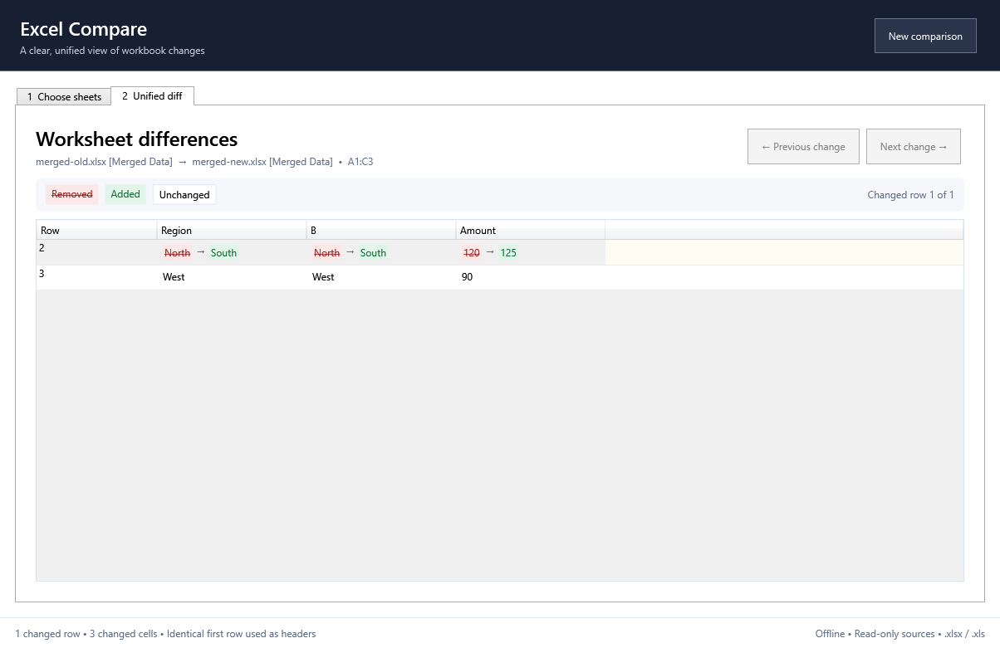

# Excel Compare

Excel Compare is an offline Windows desktop tool that presents two `.xlsx` or legacy `.xls` worksheets as one clear visual diff. It detects inserted and removed rows or columns so one structural change does not create a cascade of false differences.



## Try the demo

Download the [older employee roster](outputs/readme-demo/employee-roster-old.xlsx) and [newer employee roster](outputs/readme-demo/employee-roster-new.xlsx), select the worksheet in each file, and compare them.

## Use

1. Run `ExcelDiff.exe`.
2. Choose the older and newer `.xlsx` or `.xls` files.
3. Select one worksheet from each file and choose **Compare worksheets**.
4. Review the unified worksheet: red struck-through values were removed, green values were added, and changed cells show both old and new values.
5. Use **Previous change** and **Next change** to move between changed rows. Consecutive unchanged rows are folded automatically.

When the first row is identical in both worksheets, its values become the unified view's column headers and the row is not repeated in the grid. If the first row differs, the grid keeps the Excel column letters and compares row 1 normally.

When the selected worksheets contain the same values, the unified view displays a prominent confirmation instead of leaving users to infer the result from an empty change count.



Source workbooks are opened read-only. The app never runs formulas, macros, or external links. Formula cells are compared using their last saved results.

The portable application does not require installation. To remove it, close the
application and delete its extracted folder.

Merged cells are normalized by repeating the top-left saved value across every cell in the merged range. For example, a merged `A1:B1` containing `FOO` is compared and displayed as `FOO` in both A1 and B1, including when that merged range supplies the automatic first-row headers.

Try this behavior with the [older merged-cell workbook](outputs/merged-cell-demo/merged-old.xlsx) and [newer merged-cell workbook](outputs/merged-cell-demo/merged-new.xlsx).



## Build

Requirements: Windows 10/11 x64 and the .NET 8 SDK.

```powershell
.\build.ps1
```

The script locates either the repository-local SDK or an installed .NET 8 SDK, restores packages, runs the tests, and builds the portable application. The application folder and ZIP are written to `artifacts`.

To build without running tests:

```powershell
.\build.ps1 -SkipTests
```

Release builds use an explicit three-part version so their file metadata can be
verified before signing:

```powershell
.\build.ps1 -Version 0.3.0 -LockedMode
```

## Supported scope

- `.xlsx` and legacy `.xls` input files
- One selected worksheet pair per comparison
- Automatic used range from `A1` through the furthest populated cell
- Automatic inserted/removed row and column alignment
- Unified cell view with folded unchanged rows and changed-row navigation
- Identical first rows automatically displayed as meaningful column headers
- Clear confirmation when the selected worksheets are equal
- Merged ranges compared as repeated copies of their top-left value
- Text, number, date, Boolean, blank, error, and saved formula-result values
- Formatting, charts, comments, macros, and workbook structure are intentionally ignored

## Code signing policy

Official signed releases are built from tagged source by GitHub Actions and
submitted to SignPath for manual approval. Free code signing is provided by
[SignPath.io](https://signpath.io/), certificate by
[SignPath Foundation](https://signpath.org/).

See the [code signing policy](CODE_SIGNING_POLICY.md), [privacy policy](PRIVACY.md),
and [third-party notices](THIRD-PARTY-NOTICES.md). Signed release notes must link
to the code signing policy.

## License

Excel Compare is available under the [MIT License](LICENSE).
